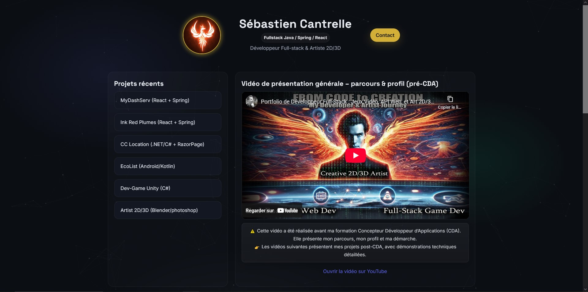

# 🌍 Sébastien Cantrelle – Portfolio

> Fullstack Developer – Java / Spring Boot / React  
> RNCP Level 6 – Concepteur Développeur d'Applications  
> Open to work · Amiens, France · Remote possible

<p align="center">
  
</p>

[](https://spiritzen.github.io/portfolio/)
[](https://github.com/Spiritzen)
[](https://www.linkedin.com/in/sebastien-cantrelle-26b695106/)

---

## 🚀 Live Portfolio

### 👉 [https://spiritzen.github.io/portfolio/](https://spiritzen.github.io/portfolio/)

---

## 🧩 Featured Projects

### ✦ Creative Suite *(most recent — open source, 100% browser)*

| Tool | Description | Stack | Demo |
|------|-------------|-------|------|
| 🎛️ **BeatStudio** | Professional step sequencer | React · TypeScript · Tone.js | [Live](https://spiritzen.github.io/BeatStudio/) |
| ⚡ **EasyStudio** | Visual editor — logos, thumbnails, animations | React · TypeScript · Fabric.js · GSAP | [Live](https://spiritzen.github.io/EasyStudio/) |
| 🎬 **MotionStudio** | Web animation editor with timeline | React · TypeScript · GSAP · Web Audio API | [Live](https://spiritzen.github.io/MotionStudio/) |

### 🔹 MyDashServ
Training session planning & scheduling engine  
`React` · `Spring Boot` · `JWT` · `MariaDB` · `REST API`

### 🔹 Ink Red Plumes
Fullstack book management platform with role-based access  
`React` · `Spring Boot` · `MySQL` · `JWT` · `REST API`

### 🔹 CC Location
Vehicle rental management system  
`.NET` · `C#` · `Razor Pages` · `Azure` · `MVC`

### 🔹 EcoList
Eco-friendly shopping list mobile app  
`Android` · `Kotlin`

### 🔹 Dev-Game Unity
3D game development project  
`Unity` · `C#`

### 🔹 Artist 2D/3D
Creative 2D/3D artwork portfolio  
`Blender` · `Photoshop`

---

## 🛠 Tech Stack

**Frontend** — React 19 · Vite 7 · JavaScript · TypeScript · CSS Modules · React Router  
**Backend** — Java · Spring Boot · Spring Security · JWT · .NET · C# · Razor Pages  
**Data** — SQL · MySQL · MariaDB · MCD/MLD · HeidiSQL  
**DevOps** — Git · GitHub Actions · GitHub Pages · Docker · Azure · Postman  
**Creative Suite** — Tone.js · Web Audio API · Fabric.js · GSAP · MediaRecorder API

---

## 🏗 Architecture Philosophy

- Business logic before UI — server-side validation
- Layered architecture — Controller / Service / Repository
- Clean REST API design — JWT, role-based access
- SQL discipline — proper data modeling, constraints, coherence
- Deliverable mindset — clean demos, maintainable code

---

## ⚙️ Local Setup
```bash
git clone https://github.com/Spiritzen/portfolio.git
cd portfolio
npm install
npm run dev
```

➡️ Open **http://localhost:5173/portfolio/**

---

## 🚀 Deployment

Automated via **GitHub Actions** on every push to `main` → build → GitHub Pages.

➡️ **https://spiritzen.github.io/portfolio/**

---

## 👤 Author

**Sébastien Cantrelle** — Fullstack Developer · RNCP Niveau 6  
Amiens, France · Télétravail possible

[](https://www.linkedin.com/in/sebastien-cantrelle-26b695106/)
[](https://github.com/Spiritzen)
[](mailto:sebastien.cantrelle@hotmail.fr)

*Portfolio · React 19 · Vite 7 · GitHub Pages · 2026*
